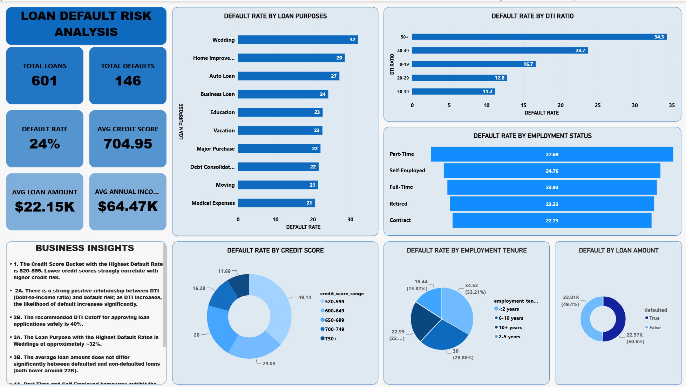
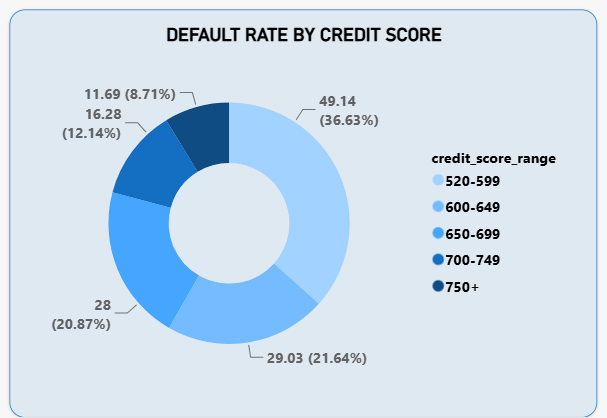
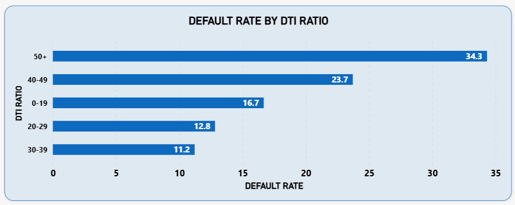
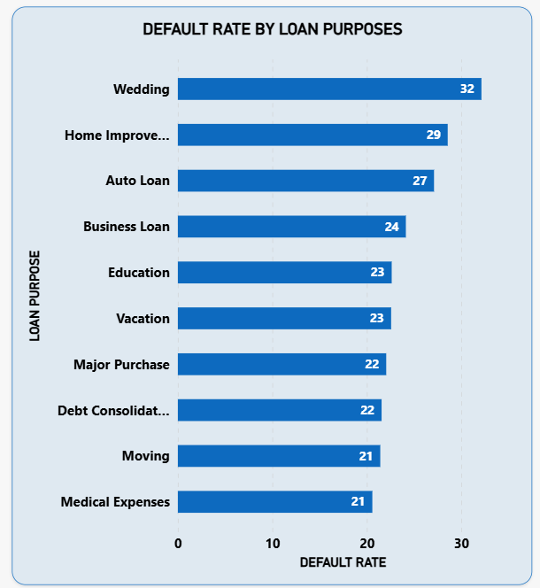
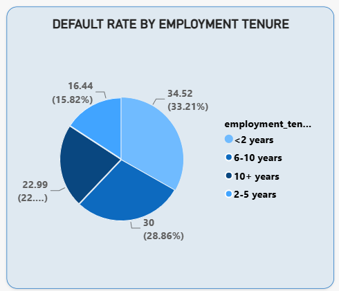
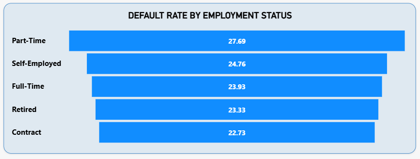
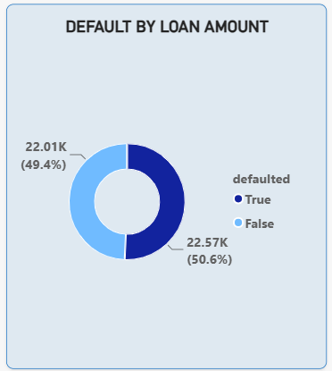

# 💳 Credit Risk Analytics Project (SQL + Power BI)

An end-to-end analytics project on **loan default risk**. The project covers the main stages of a real credit-risk workflow: exploring relational loan and borrower tables in SQL Server, segmenting borrowers into risk brackets, extracting key default metrics, and presenting the findings in an interactive Power BI dashboard.

---

## 🎯 Business Question

> **Which borrower characteristics are most strongly associated with loan default, and where does portfolio risk concentrate?**

The analysis looks at credit score, debt-to-income (DTI) ratio, loan purpose, loan amount, employment status and employment tenure to identify the segments a lender should watch most closely.

**Portfolio baseline:** **146 of 601 loans defaulted (24.29%)**. This is the reference point for every segment below.

---

## 🛠️ Project Workflow & Technical Highlights

### 1. Database & Data Model
- Worked in **SQL Server** with two relational tables: `loan_applications` (loan-level records and default flag) and `borrower_profiles` (credit score, employment status, tenure), linked by `borrower_id`.
- Data imported manually via SSMS Flat File Import Wizard.
- Each analysis step is saved as its own result table (`SELECT ... INTO`), and the script is re-runnable (`DROP TABLE IF EXISTS`), so refreshed outputs feed directly into Power BI.

### 2. Exploratory Data Analysis (EDA)
Ran a structured **8-step EDA process**:

| Step | Analysis |
|------|----------|
| 1 | Overall portfolio default rate |
| 2 | Default rate by credit score range |
| 3 | Default rate by DTI ratio range |
| 4 | Default rate by loan purpose |
| 5 | Loan amount vs. default status |
| 6 | Default rate by employment status |
| 7 | Default rate by employment tenure |
| 8 | Targeted check: borrowers with <2 years of employment |

### 3. Risk Segmentation & Data Quality
- Converted continuous variables (credit score, DTI, years employed) into risk brackets using `CASE` expressions.
- Used a **CTE** to keep the tenure bucketing readable and to apply a custom sort order to the output.
- **Data quality catch:** found that **540 DTI values were decimals** (e.g. 29.5). Ranges like `BETWEEN 20 AND 29` silently skip them, pushing them into the `'50+'` bucket and inflating its default rate. Rebuilt the DTI brackets as half-open intervals (`< 20`, `< 30`, `< 40`, `< 50`) to remove the gaps, and confirmed `years_employed` contains whole numbers only.
- Standardized every step on the same three metrics: `total_loans`, `total_defaults`, `default_percentage`.

### 4. Dashboard Design (Power BI)
- Built an executive dashboard with KPI cards, default-rate charts per risk driver, and interactive filters for borrower segments.

---

## 📈 Key Insights

- **Credit score:** default risk falls steadily as credit health improves, from **49.14%** in the 520–599 bracket to **29.03%** (600–649), **28.00%** (650–699), **16.28%** (700–749) and **11.69%** (750+).
- **DTI threshold at 40%:** below 40% DTI, default rates stay between **11.21% and 16.67%**. They then jump to **23.71%** at 40–49% and **34.32%** at 50%+. The 50%+ group holds **45% of all loans but ~64% of all defaults** (93 of 146).
- **Short employment tenure:** borrowers employed for **less than 2 years** default at **34.52%**, versus **22.63%** for everyone else. The pattern is non-linear: 2–5 years is the safest group (16.44%), while 6–10 years rises to 30.00% and 10+ years sits at 22.99%.
- **Loan purpose:** default rates range from **20.59%** (Medical Expenses) to **32.14%** (Wedding), with Home Improvement (28.57%) and Auto Loan (27.12%) next.
- **Employment status** is a weak differentiator: all categories sit between **22.73%** (Contract) and **27.69%** (Part-Time), close to the 24.29% portfolio average.
- **Loan size is not a differentiator:** average loan amounts are very close for defaulted ($22,571) and non-defaulted ($22,013) loans, so *who* borrows matters more than *how much*.

> 💡 **Takeaway:** Default risk concentrates in borrowers with **DTI above 40%** (especially 50%+) and **low credit scores** (below 600), with short employment history adding further risk. These are the clearest filters a lender could prioritize in underwriting.

---

## ⚠️ Limitations
- The dataset is small (**601 loans**), and some segments are very small (e.g. 48 loans in the 0–19 DTI bracket, 51–70 loans per loan purpose), so small differences between segments should be treated as indicative rather than conclusive.
- The analysis shows **association, not causation**, and does not include statistical significance testing.
- Each factor is analyzed on its own; combined effects (e.g. low credit score *and* high DTI) are a natural next step.

---

## 📷 Project Screenshots & Visualizations

### 📊 Power BI Dashboard

### Executive Overview

*Executive summary with key risk KPIs, default distributions, and borrower segment filters.*

### Default Rate by Credit Score

*Default rate across credit score ranges, highlighting the 520–599 high-risk bracket.*

### Default Rate by DTI Ratio

*Default percentage by debt-to-income tier, with a sharp increase above 40%.*

### Default Rate by Loan Purpose

*Loan purposes ranked by default rate, with Wedding and Home Improvement at the top.*

### Default Rate by Employment Tenure

*Impact of employment length on default, especially for borrowers with <2 years.*

### Default Rate by Employment Status

*Default rate variation across employment categories.*

### Loan Amount: Defaulted vs. Non-Defaulted

*Average loan size for defaulted and non-defaulted loans.*

---

## 📂 Project Files & Structure

- [`eda.sql`](eda.sql): 8-step exploratory data analysis and risk metric extraction
- [`CREDIT RISK DASHBOARD.pbix`](CREDIT%20RISK%20DASHBOARD.pbix): interactive Power BI report
- `screenshots/`: dashboard visuals used in this README

---

## 🧰 Tools & Skills Demonstrated

**SQL Server** · `CASE` bucketing · CTEs · joins · aggregations · data quality checks · `SELECT ... INTO` · **Power BI** · dashboard design · risk segmentation · business storytelling

---

## ✅ Project Status
- [x] Relational data structure and analysis tables built in SQL Server
- [x] 8-step EDA and risk metric extraction completed
- [x] Data quality issue (decimal DTI values) identified and fixed
- [x] Power BI dashboard designed with risk KPIs and interactive filters
- [x] Documentation and visual showcase published
