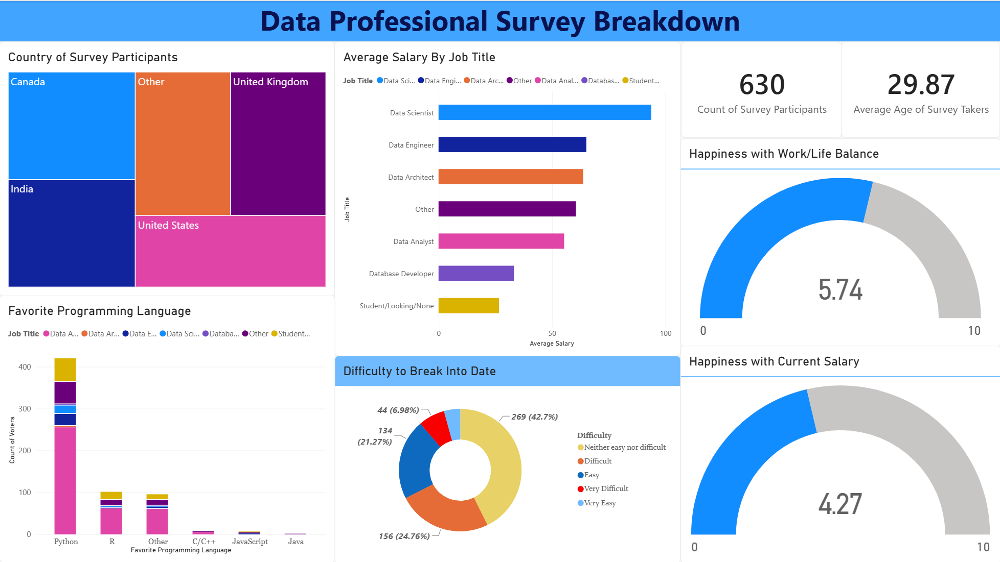
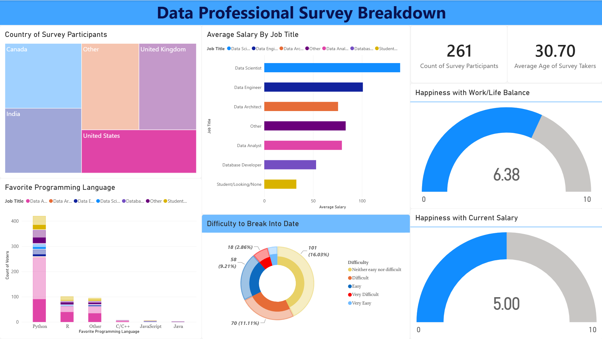
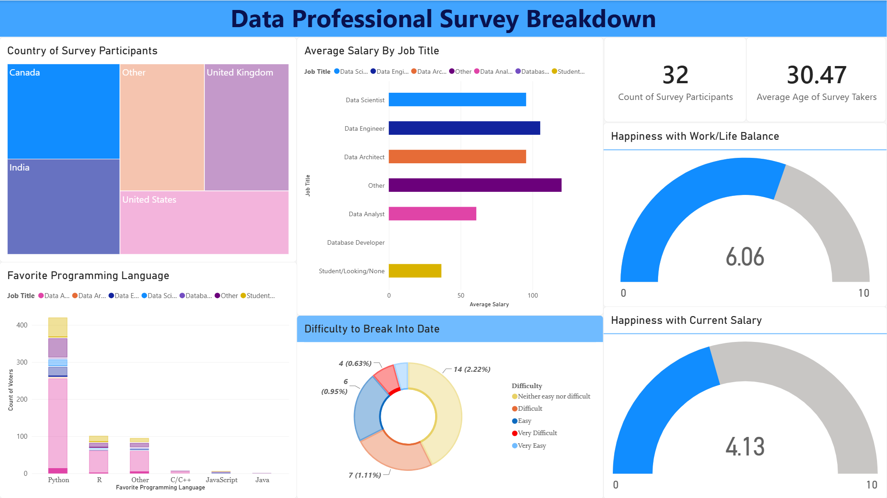
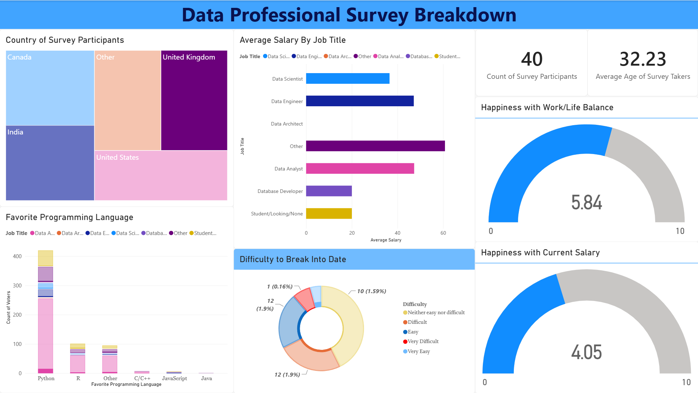
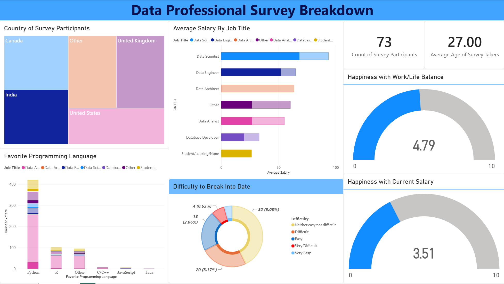
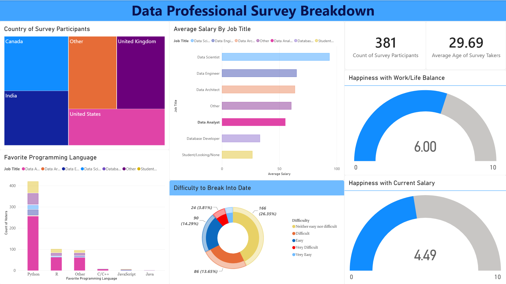
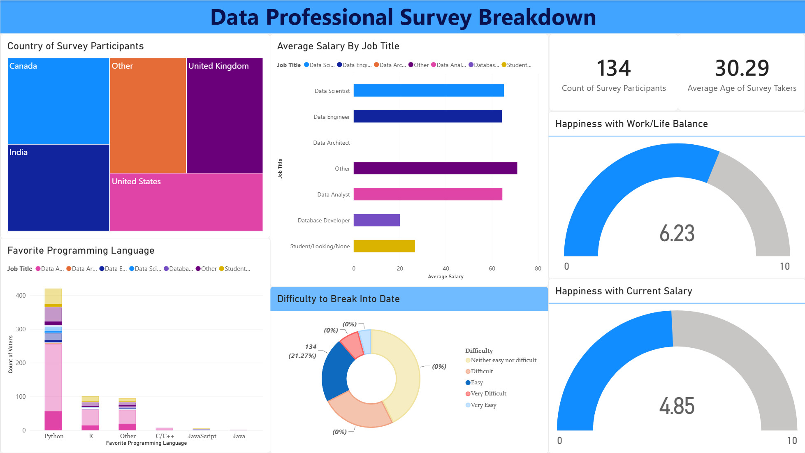

# 📊 Data Professional Survey Dashboard (Power BI)

An end-to-end Power BI data analytics project analyzing survey responses from **630 data professionals** worldwide. This project covers the complete data analytics lifecycle—from raw data ingestion and ETL processing to advanced data modeling and interactive visualization.

---

## 🛠️ Project Workflow & Technical Highlights

### 1. Power Query & ETL (Data Transformation)
* Cleaned and prepped raw survey responses.
* Handled missing values, standardized messy text columns, and transformed data types to ensure high data quality.
* Created custom conditional columns to segment data effectively.

### 2. Data Modeling & DAX Measures
* Built a robust star/relational data model.
* Wrote custom **DAX measures** for complex calculations:
  * **Average Salary** across different job titles and experience levels.
  * **Age Demographics** and regional distributions.
  * **Satisfaction Scores** (Work/life balance vs. Salary satisfaction).

### 3. Interactive Dashboard & Visualization
* Designed dynamic cross-filtering charts allowing users to click on any visual to filter the entire report.
* Utilized KPI cards, bar charts, and gauge visuals to highlight key performance indicators.

---

## 📈 Key Insights
* **Salary Disparities:** Average salary varies significantly across roles, with *Data Scientists* and *Data Engineers* leading the compensation tiers.
* **Work/Life Balance:** Work/life balance satisfaction averages **5.74/10**, trailing slightly behind overall compensation satisfaction.

---

## 📷 Dashboard Preview

---

## 📂 Project Files
* [`Data-professional-survey-dashboard.pbix`](Data-professional-survey-dashboard.pbix) — The complete Power BI report file (download and open with Power BI Desktop).
