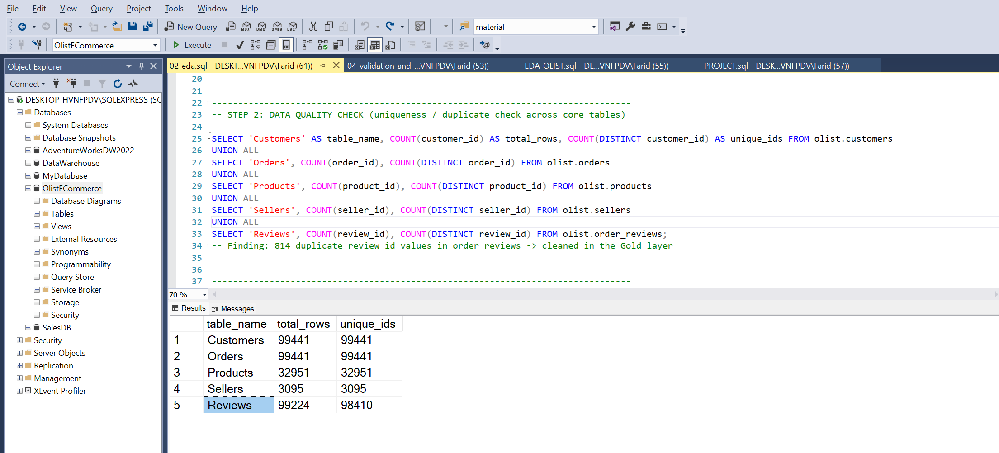
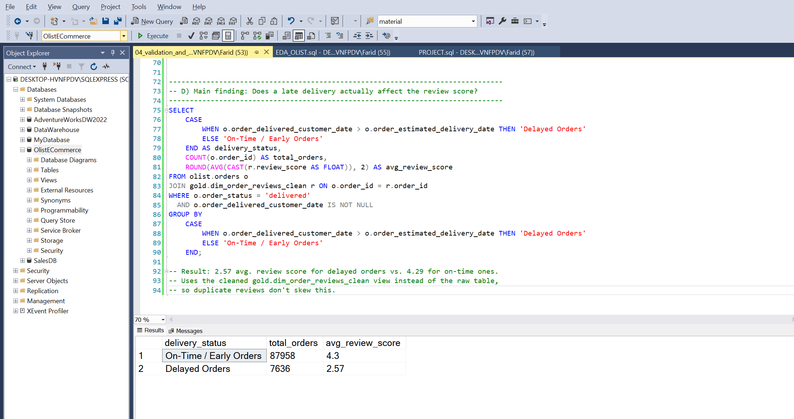
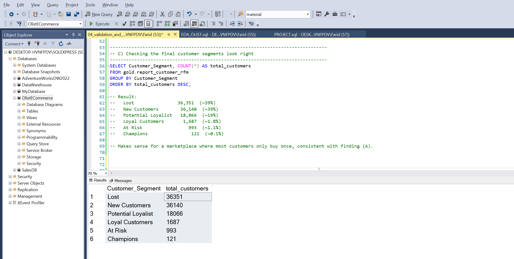
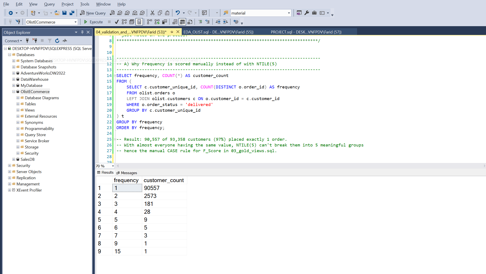
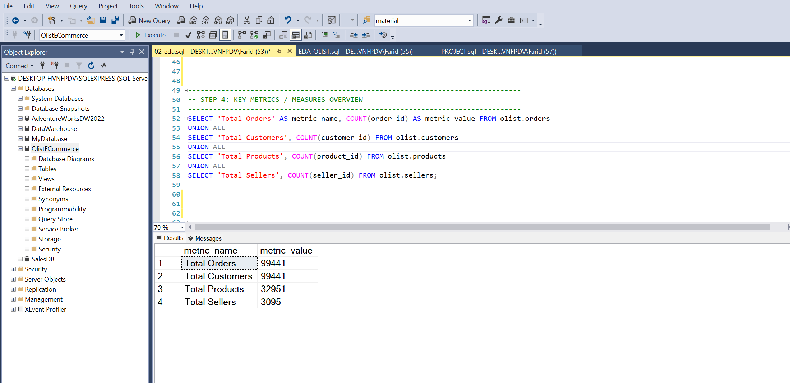

# 🛒 Olist E-Commerce Analytics Project (SQL)

An end-to-end SQL analytics project on the **Olist Brazilian E-Commerce dataset** (~100K orders, 9 relational tables). The project covers the main stages of a real analytics workflow: exploring an unfamiliar database, finding and fixing data quality issues, building a customer segmentation model, and pulling out business insights.

---

## 🛠️ Project Workflow & Technical Highlights

### 1. Database Setup & Architecture
* Built the database from scratch in **SQL Server**, loading 9 raw CSV tables via `BULK INSERT`.
* Kept raw data untouched in an `olist` schema and put all cleaning/business logic in a separate `gold` schema, so reports stay in sync as new data comes in.

### 2. Exploratory Data Analysis (EDA)
* Ran a structured **8-step EDA process**: structure → data quality → date range → key metrics → categories → segmentation → rankings → cross-checking metrics against each other.
* Found **814 duplicate `review_id` values** in the reviews table during the data quality check.

### 3. Data Cleaning
* Built `gold.dim_order_reviews_clean` using `ROW_NUMBER()` to remove the duplicate reviews, keeping only the latest version of each one.

### 4. Customer Segmentation (RFM)
* Scored every customer on **Recency, Frequency, and Monetary** value and grouped them into 6 segments (Champions, Loyal, New, At Risk, Potential Loyalist, Lost).
* `NTILE(5)` didn't work for Frequency — 97% of customers had placed exactly one order, so there wasn't enough variety to split them into 5 real groups. Scored that one manually instead; Recency and Monetary worked fine with `NTILE(5)`.

### 5. Business Insight Analysis
* Compared review scores for delayed vs. on-time deliveries to check whether delivery performance actually affects customer satisfaction.

---

## 📈 Key Insights

* **Delivery delays hurt satisfaction — a lot:** delayed orders average a **2.57** review score vs. **4.29** for on-time ones, about a 40% drop.
* **Most customers only buy once:** 97% of customers (90,557 of 93,358) placed exactly one order — a key reason the RFM scoring needed a custom approach for Frequency.
* **Customer base skews toward "Lost" and "New":** together they make up ~78% of customers, with true "Champions" being rare (~0.1%) — expected for a marketplace with a low repeat-purchase rate.
* **Data quality matters:** 814 duplicate reviews were quietly inflating the review count before cleaning — a reminder to never trust raw data at face value.

---

## 📷 Query & Result Screenshots

*Duplicate `review_id` values found during the data quality check*

*Delayed vs. on-time orders — average review score*

*Final customer segment counts*

*Why Frequency needed a manual scoring rule instead of NTILE(5)*

*Total orders, customers, products, and sellers*

---

## 📂 Project Files

* [`01_database_setup.sql`](01_database_setup.sql) — schema, tables, raw data load
* [`02_eda.sql`](02_eda.sql) — 8-step exploratory data analysis
* [`03_gold_views.sql`](03_gold_views.sql) — cleaned reviews + RFM segmentation views
* [`04_validation_and_insights.sql`](04_validation_and_insights.sql) — model validation + key findings

---

## 🔜 Next Steps

* [ ] Build a Power BI dashboard on the `gold` schema views (KPIs, delivery performance, customer segments)
* [ ] Publish an interactive dashboard link
